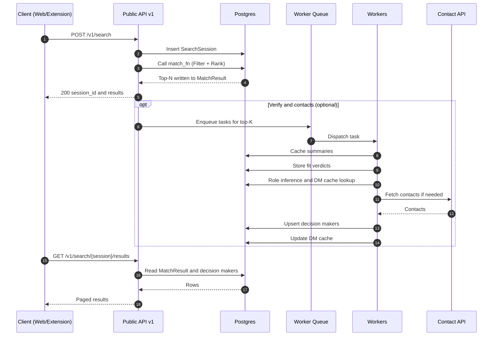

```markdown
# Agent Search & Enrichment (Sequence)
```


```mermaid
sequenceDiagram
  autonumber
  participant Client as Client (Web/Extension)
  participant API as Public API v1
  participant DB as Postgres
  participant Q as Worker Queue
  participant W as Workers
  participant Provider as Contact API

  Client->>API: POST /v1/search
  API->>DB: Insert SearchSession
  API->>DB: Call match_fn (Filter + Rank)
  DB-->>API: Top-N written to MatchResult
  API-->>Client: 200 session_id and results

  opt Verify and contacts (optional)
    API->>Q: Enqueue tasks for top-K
    Q->>W: Dispatch task
    W->>DB: Cache summaries
    W->>DB: Store fit verdicts
    W->>DB: Role inference and DM cache lookup
    W->>Provider: Fetch contacts if needed
    Provider-->>W: Contacts
    W->>DB: Upsert decision makers
    W->>DB: Update DM cache
  end

  Client->>API: GET /v1/search/{session}/results
  API->>DB: Read MatchResult and decision makers
  DB-->>API: Rows
  API-->>Client: Paged results
```
