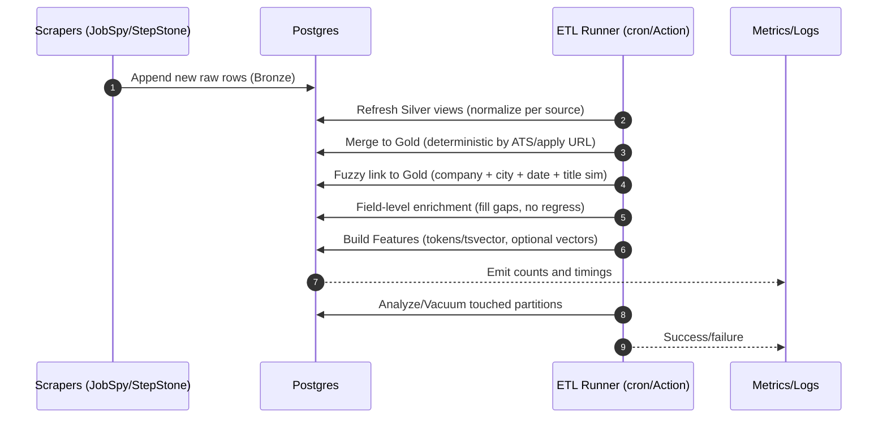

```markdown
# Nightly ETL (Bronze → Silver → Gold)
```


```mermaid
sequenceDiagram
  autonumber
  participant Scrapers as Scrapers (JobSpy/StepStone)
  participant DB as Postgres
  participant ETL as ETL Runner (cron/Action)
  participant Metrics as Metrics/Logs

  Scrapers->>DB: Append new raw rows (Bronze)
  ETL->>DB: Refresh Silver views (normalize per source)
  ETL->>DB: Merge to Gold (deterministic by ATS/apply URL)
  ETL->>DB: Fuzzy link to Gold (company + city + date + title sim)
  ETL->>DB: Field-level enrichment (fill gaps, no regress)
  ETL->>DB: Build Features (tokens/tsvector, optional vectors)
  DB-->>Metrics: Emit counts and timings
  ETL->>DB: Analyze/Vacuum touched partitions
  ETL-->>Metrics: Success/failure
```
